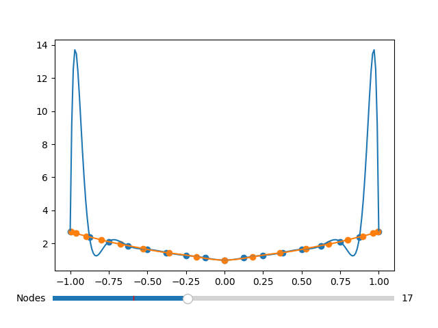

# DSA2102
**Essential Data Analytics Tools: Numerical Computation**

Some useful Python codes by me to visualize things in the module.

### [dsa2102](dsa2102/)
See this [README.md](dsa2102/README.md) for more information.

### [`tridiag.py`](tridiag.py)
Just a function to print the square matrix as shown below. Can handle various sizes.

### [`plot_chebyshev.py`](plot_chebyshev.py)
A simple plot for comparing a function with its Chebyshev interpolating polynomial.

### [`runge_slider.py`](runge_slider.py)
Observe the Runge phenomenon as we query various number of nodes to interpolate a certain function.
Compare the even-spaced interpolating function with the Chebyshev interpolating function.

More pictures can be found [here](assets/), but I will show one of the plots below.

### [`romberg.py`](romberg.py)
Displays the Romberg integration table in a nice manner.
